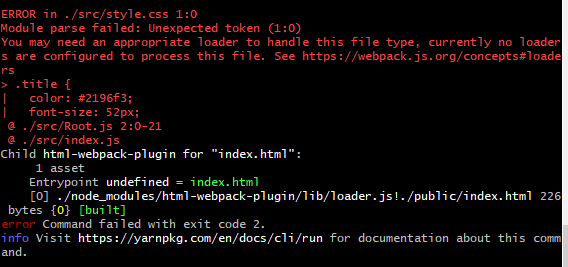
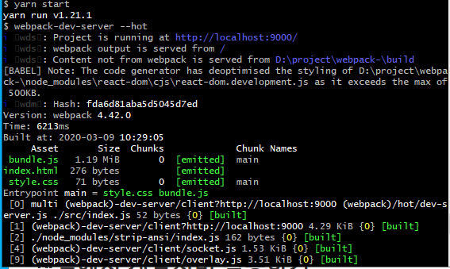

# React 환경에서의 webpack 정리(1)

react 개발을 진행하면서 웹팩에 대한 개념을 정리하고 이를 통해서 손쉽게 웹팩을 다룰수 있도록 목표를 갖고 작성하였습니다.

## 모듈 번들러란?

- 여러개의 나누어져 있는 파일들을 하나의 파일로 만들어주는 라이브러리를 말함
- 웹팩, parcel등이 이에 해당함.
- 모듈 번들러를 통해서 여러개의 자바 스크립트 파일을 하나의 파일로 묶어 한번의 요청에 모두 가져올수 있는 장점이 생김
- 또한, 최신 자바스크립트 문법을 브라우저에서 사용할수 있게 해주었음.
- 마지막으로, 모듈 번들러를 통해서 자바스크립트 코드를 압축하고 최적화 할수 있어서 로딩속도를 높일수 있음.
- 물론, 수많은 자바 스크립트 파일이 하나의 파일로 묶인다면 초기 로딩속도가 오래걸린다
- 이러한 문제 해결을 위해서 청크, 캐시, 코드 스플릿 등의 개념이 생김


# 실습

### 프로젝트 설정

```
mkdir webpack-react
cd webpack-react
yarn init -y

//실습에 사용할 라이브러리 모두 설치 진행
yarn add -D @babel/core @babel/preset-env @babel/preset-react babel-loader clean-webpack-plugin css-loader html-loader html-webpack-plugin mini-css-extract-plugin node-sass react react-dom sass-loader style-loader webpack webpack-cli webpack-dev-server

```

### 웹팩으로 자바스크립트 파일 빌드

- src 디렉터리를 만들고 아래와 같이 진행

```
//src/test.js
console.log("webpack - test")

//최상위 디렉토리이동후 webpack.config.js 파일 작성
const path = require("path");

module.exports = {
  entry: "./src/test.js",
  output: {
    filename: "bundle.js",
    path: path.resolve(__dirname + "/build")
  },
  mode: "none"
};

```

- entry 는 웹팩이 빌드할 파일을 알려주는 역할을 함.
- output은 웹팩에서 빌드를 완료하면 output에 명시되어 있는 정보를 통해 빌드파일을 생성
- mode는 웹팩의 옵션
  - production은 최적화 되어 빌드되어지는 특징을 가짐
  - development는 빠르게 빌드하는 특징
  - none 같은 경우 아무 기능 없이 웹팩으로 빌드

```
//package.json 파일 이동 하여 아래 코드를 추가
  "scripts": {
    "build": "webpack"
  },
```

- 명령어 webpack 실행시 디폴트로 실행할 파일은 같은 경로에 있는 webpack.config.js 이다.

```
//터미널
yarn build
```

- 명령어 실행후 build/bundle.js 파일이 생성된다.


### 웹팩을 통해서 HTML 파일 빌드하기

- 웹팩은 로더(loader)라는 기능을 통해서 자바스크립트 파일이 아닌 파일을 웹팩이 이해할수 있도록 도와준다.

```
module : {
	rules: {
		test: '가지고올 파일 정규식',
		use: [
			{
				loader: '사용할 로더 이름',
				options: { 사용할 로더 옵션 }
			}
		]
	}
}
```

```
//public/index.html 파일 생성

<!DOCTYPE html>
<html lang="kr">
  <head>
    <meta charset="utf-8" />
    <title>WEBPACK4-REACT</title>
  </head>
  <body>
    <noscript>스크립트가 작동되지 않습니다!</noscript>
    <div id="root"></div>
  </body>
</html>
```

- 그후 webpack.config.js 파일에 아래와 같은 html 관련 코드 추가(module 및 plugins 부분)

```
const path = require("path");
const HtmlWebPackPlugin = require("html-webpack-plugin");

module.exports = {
  entry: "./src/test.js",
  output: {
    filename: "bundle.js",
    path: path.resolve(__dirname + "/build")
  },
  mode: "none",
  module: {
    rules: [
      {
        test: /\.html$/,
        use: [
          {
            loader: "html-loader",
            options: { minimize: true }
          }
        ]
      }
    ]
  },
  plugins: [
    new HtmlWebPackPlugin({
			template: './public/index.html', // public/index.html 파일을 읽는다.
      filename: 'index.html' // output으로 출력할 파일은 index.html 이다.
    })
  ]
};
```

- html-webpack-plugin은 웹팩이 html 파일을 읽어서 html 파일을 빌드할수 있게 도와줌
- loader는 html 파일을 읽었을때 html-loader를 실행하여 웹팩이 이해할 수 있게 함
- options 은 minimize라는 코드 최적화 옵션을 추가함.(한줄로 나오게함)

```
//터미널
yarn build

//결과
build/index.html 파일 생성
```

### 웹팩으로 리엑트 빌드하기

```
//src/index.js

import React from "react";
import ReactDOM from "react-dom";
import Root from "./Root";

ReactDOM.render(<Root />, document.getElementById("root"));

//src/Root.js

import React from 'react';

const Root = () => {
  return (
    <h3>Hello, React</h3>
  );
};

export default Root;
```

- 그후 최상위 디렉토리에서 .babelrc 파일을 만들고 아래와 같은 내용 입력

```
{
  "presets": ["@babel/preset-env", "@babel/preset-react"]
}

//바벨은 es6에서 es5로 자바스크립트를 변환해주는 역할을 한다.
```

```
//webpack.config.js 파일에 entry와 rules에 babel-loader를 추가해줌.

const path = require("path");
const HtmlWebPackPlugin = require("html-webpack-plugin");

module.exports = {
  entry: "./src/index.js",
  output: {
    filename: "bundle.js",
    path: path.resolve(__dirname + "/build")
  },
  mode: "none",
  module: {
    rules: [
      {
        test: /\.(js|jsx)$/,
        exclude: "/node_modules",
        use: ['babel-loader'],
      },
      {
        test: /\.html$/,
        use: [
          {
            loader: "html-loader",
            options: { minimize: true }
          }
        ]
      }
    ]
  },
  plugins: [
    new HtmlWebPackPlugin({
      template: './public/index.html', // public/index.html 파일을 읽는다.
      filename: 'index.html' // output으로 출력할 파일은 index.html 이다.
    })
  ]
};
```

# React 환경에서의 webpack 정리(2)

react 개발을 진행하면서 웹팩에 대한 개념을 정리하고 이를 통해서 손쉽게 웹팩을 다룰수 있도록 목표를 갖고 작성하였습니다.

## 웹팩에서 css 사용하기

```
//src/style.css를 만들기

.title {
color: #2196f3;
font-size:52px;
text-align:center;
}
```

```
//src/Root.js 에서 style.css 를 가져올수 있도록 import 진행

import React from 'react';
import './style.css';
const Root = () => {
  return <h3>Hello, React</h3>;
};

export default Root;
```

- 그후 yarn build 명령어로 빌드를 진행할 경우 file을 읽을수 없다고 나온다.




- 그 이유는 css-loader가 없기때문이다 -> css loader 적용을 통해서 css를 읽을수 있게 해준다.

```
//webpack.config.js에 css-loader를 추가해 줌.
      {
        test: /\.css$/,
        use: ['css-loader'],
      },
```

- 그후 yarn build를 진행하면 정상적으로 build는 되나 css가 적용 되지 않는다.
- 그 이유는 웹팩에서 css 파일을 읽은후 어딘가에 저장을 해야하기 때문이다.
- 2가지 방법이 존재함.
  - index.html 파일에 css를 합치는 방법(index에서 직접 css 선언)
  - 파일을 추출하여 따로 저장(webpack.config에서 css 추출하는 플러그인 적용)

```
//webpack.config.js에 css추출후 파일로 저장하는 플러그인 추가.
const path = require("path");
const HtmlWebPackPlugin = require("html-webpack-plugin");
const MiniCssExtractPlugin = require("mini-css-extract-plugin");

module.exports = {
  entry: "./src/index.js",
  output: {
    filename: "bundle.js",
    path: path.resolve(__dirname + "/build")
  },
  mode: "none",
  module: {
    rules: [
      {
        test: /\.(js|jsx)$/,
        exclude: "/node_modules",
        use: ['babel-loader'],
      },
      {
        test: /\.html$/,
        use: [
          {
            loader: "html-loader",
            options: { minimize: true }
          }
        ]
      },
      {
        test: /\.css$/,
        use: [MiniCssExtractPlugin.loader, 'css-loader']
      }
    ]
  },
  plugins: [
    new HtmlWebPackPlugin({
      template: './public/index.html', // public/index.html 파일을 읽는다.
      filename: 'index.html' // output으로 출력할 파일은 index.html 이다.
    }),
    new MiniCssExtractPlugin({
      filename: 'style.css'
    })
  ]
};

```

- 아래와 같이 css가 적용된다.
- 

## 웹팩에서 scss 사용하기

```
//src/style.scss 파일을 만들어 추가.

$fontColor: #2196f3;
$fontSize: 52px;


.title {
  color: $fontColor;
  font-size: $fontSize;
  text-align: center;
}
```

```
//src/Root.js 에 scss 를 import 진행

import React from 'react';
import './style.scss';
const Root = () => {
  return <h3 className="title">Hello, React</h3>;
};

export default Root;

```

- 빌드시, css와 동일하게  에러가 발생.
- scss 파일을 읽을수 없기에 에러가 나옴 -> 웹팩이 scss 파일을 읽을수 있도록 해줘야 함.

```
//webpack.config.js에 scss loader를 추가한다.

    {
        test: /\.scss$/,
        use: [MiniCssExtractPlugin.loader, "css-loader", "sass-loader"]
      }
```

## 웹팩에서 개발서버 적용하기

- 수정할때마다 웹팩 빌드를 이용하면 시간적으로 많이 불편
- 소스코드를 수정할때마다 알아서 웹팩이 빌드해주는 webpack-dev-server 적용

```
//webpack.config.js 파일에 들어가 devServer를 추가
  devServer: {
    contentBase: path.resolve("./build"),
    index: "index.html",
    port: 9000
  },
  
  //package.json 파일에 들어가 script 에 yarn start 추가
 "scripts": {
	"build": "webpack",
	"start": "webpack-dev-server --hot"
} 
  

```



- 수정사항이 발생한 경우 자동으로 빌드해주는 것을 확인할수 있다.

## 빌드 디렉터리 깨끗하게 하기

- clean-webpack-plugin을 통해서 빌드될때마다 안쓰는 파일들을 삭제할수 있도록 함.

```
//webpack.config.js
//plugin에 MiniCssExtractPlugin에 filename을 style-test.css로 변경

plugins: [
	new HtmlWebPackPlugin({
		template: './public/index.html', // public/index.html 파일을 읽는다.
		filename: 'index.html' // output으로 출력할 파일은 index.html 이다.
	}),
	new MiniCssExtractPlugin({
		filename: 'style-test.css'
	})
]

```

- yarn build 명령어 후 안쓰는 style.css가 계속 남아있는것을 볼수 있음.
- clean-webpack-plugin 을 사용하여 안쓰는 build 파일을 자동으로 삭제

```
 //webpack.config.js
 
const {CleanWebpackPlugin} = require("clean-webpack-plugin");
 
 plugins: [
    new HtmlWebPackPlugin({
      template: './public/index.html', // public/index.html 파일을 읽는다.
      filename: 'index.html' // output으로 출력할 파일은 index.html 이다.
    }),
    new MiniCssExtractPlugin({
      filename: 'style-test.css'
    }),
    new CleanWebpackPlugin()
  ]
```

- 결과적으로 웹팩 빌드후 style.css가 자동삭제되는 것을 볼수 있다.

## 웹팩 빌드 모드 나누기

- 웹팩의 빌드 모드는 development, production, none
- development는 빠르게 빌드하기 위해서 빌드할때 최적화를 하지 않는다.
- production은 빌드할때 최적화 작업을 진행한다.
- none은 아무것도 하지 않는다.
- config 디렉토리에 webpack.config.dev.js 와 webpack.config.pod.js를 나누어 생성

```javascript
//webpack.config.dev.js

const path = require("path");
const HtmlWebPackPlugin = require("html-webpack-plugin");
const MiniCssExtractPlugin = require("mini-css-extract-plugin");
const {CleanWebpackPlugin} = require("clean-webpack-plugin");

module.exports = {
  entry: "./src/index.js",
  output: {
    filename: "bundle.js",
    path: path.resolve(__dirname, "../build")
  },
  mode: "development",
  devServer: {
    contentBase: path.resolve(__dirname, "../build"),
    index: "index.html",
    port: 9000
  },
  module: {
    rules: [
      {
        test: /\.(js|jsx)$/,
        exclude: "/node_modules",
        use: ["babel-loader"]
      },
      {
        test: /\.html$/,
        use: [
          {
            loader: "html-loader",
            options: { minimize: true }
          }
        ]
      },
      {
        test: /\.css$/,
        use: [MiniCssExtractPlugin.loader, "css-loader"]
      },
      {
        test: /\.scss$/,
        use: [MiniCssExtractPlugin.loader, "css-loader", "sass-loader"]
      }
    ]
  },
  plugins: [
    new HtmlWebPackPlugin({
      template: "./public/index.html",
      filename: "index.html"
    }),
    new MiniCssExtractPlugin({
      filename: "style.css"
    }),
    new CleanWebpackPlugin()
  ]
};


//config/webpack.config.prod.js

const path = require("path");
const HtmlWebPackPlugin = require("html-webpack-plugin");
const MiniCssExtractPlugin = require("mini-css-extract-plugin");
const {CleanWebpackPlugin} = require("clean-webpack-plugin");

module.exports = {
  entry: "./src/index.js",
  output: {
    filename: "bundle.[contenthash].js",
    path: path.resolve(__dirname, "../build")
  },
  mode: "production",
  module: {
    rules: [
      {
        test: /\.(js|jsx)$/,
        exclude: "/node_modules",
        use: ["babel-loader"]
      },
      {
        test: /\.html$/,
        use: [
          {
            loader: "html-loader",
            options: { minimize: true }
          }
        ]
      },
      {
        test: /\.css$/,
        use: [MiniCssExtractPlugin.loader, "css-loader"]
      },
      {
        test: /\.scss$/,
        use: [MiniCssExtractPlugin.loader, "css-loader", "sass-loader"]
      }
    ]
  },
  plugins: [
    new HtmlWebPackPlugin({
      template: "./public/index.html",
      filename: "index.html"
    }),
    new MiniCssExtractPlugin({
      filename: "style.css"
    }),
    new CleanWebpackPlugin()
  ]
};

```

- 현재 코드상의 차이는 mode 값의 production 과 development 차이이다.
- 하지만 dev 와 prod에 맞는 플러그인들을 적용하며 붙여가기 시작할 경우에 mode에 따른 강점이 생김

```
//package.json

"scripts": {
  "start": "webpack-dev-server --config ./config/webpack.config.dev --hot",
  "build": "webpack --config ./config/webpack.config.prod"
 },
```

## 마무리
실제로 웹팩을 사용하면서 설정을 몇개 안한것 같았는데 생각보다 로더가 너무 다양해서 매우 놀랐다.

개인적으로는 추가로 웹팩을 통해서 모듈 분리를 진행하는 방법을 추가로 공부해야 겠다는 생각을 하게 되었다.


마지막으로 이 웹팩 개념을 통해서 지금 진행하는 프로젝트의 웹팩 설정부터 조금 수정해야겠다..!!


출처 : [https://velog.io/@jeff0720/React-%EA%B0%9C%EB%B0%9C-%ED%99%98%EA%B2%BD%EC%9D%84-%EA%B5%AC%EC%B6%95%ED%95%98%EB%A9%B4%EC%84%9C-%EB%B0%B0%EC%9A%B0%EB%8A%94-Webpack-%EA%B8%B0%EC%B4%88](https://velog.io/@jeff0720/React-개발-환경을-구축하면서-배우는-Webpack-기초)


